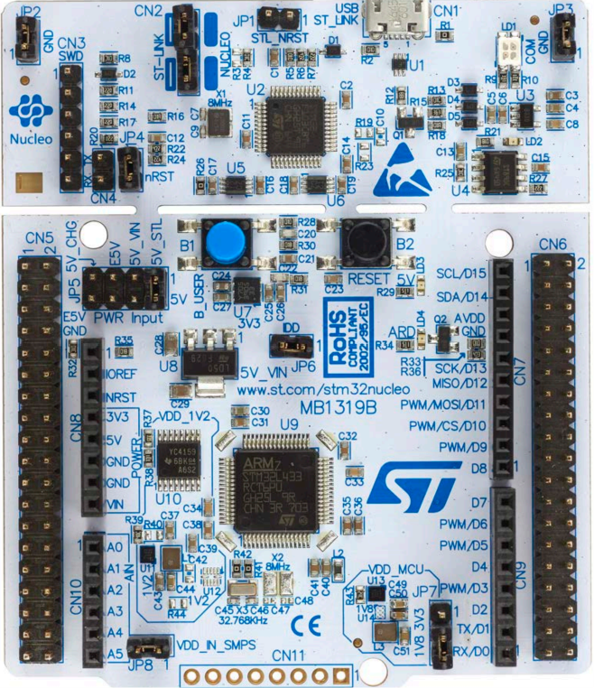
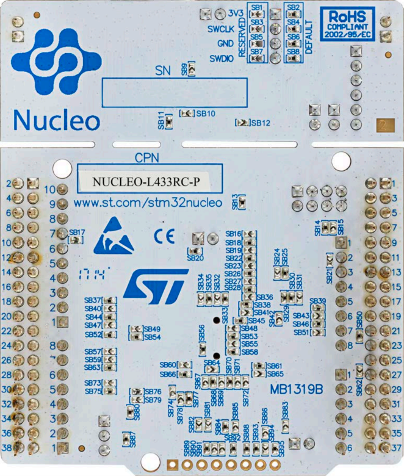
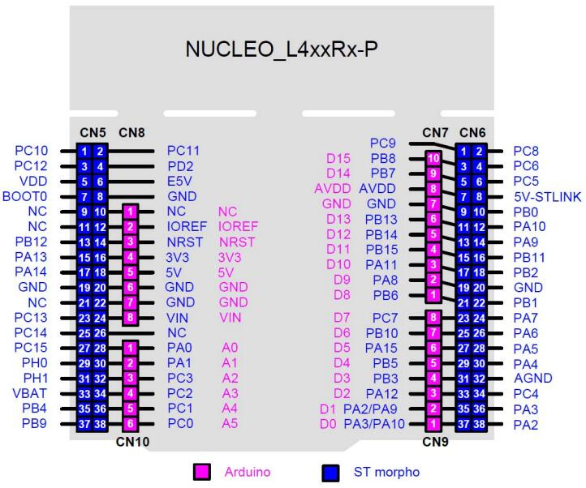

# A reference platform based on STM32
用 STM32 建置一個參考用的開發平台

# Board View
## Nucleo-64-P
<p align="center">
  
  
</p>

## Pinout
<p align="center">
  
</p>

# STM32 開發環境及套件
## Board -> NUCLEO-L433RC-P（MB1319 PCB）
EVK :NUCLEO-L433RC-P (MB1319 PCB with STM32L433RCT6)
Board: MB1319
SOC: STM32L433RCT6  
[NUCLEO-L433RC-P](notes\nucleo-l433rc-p.md)

## IDE -> STM32CubeIDE
STM32 在 Eclipse 的基礎上開發的 IDE  
[STM32CubeIDE](notes\stm32cubeide.md)

## 專案啟動工具 STM32CubeMX
設定硬體並產生初始專案  
[STM32CubeMX](notes\stm32-STM32CubeMX.md)

## Setup reference
[Setup Reference](notes\stm32-setup.md)

# 遷移及複製工具
## 複製專案
複製專案到另一個名稱, 以便 import 到 workspace
```
stm32cubeide_clone.bat
stm32cubeide_clone.py

stm32cubeide_clone.bat "l433_spi_master_test" "l433_spi_master_poc"
```
# 專案列表